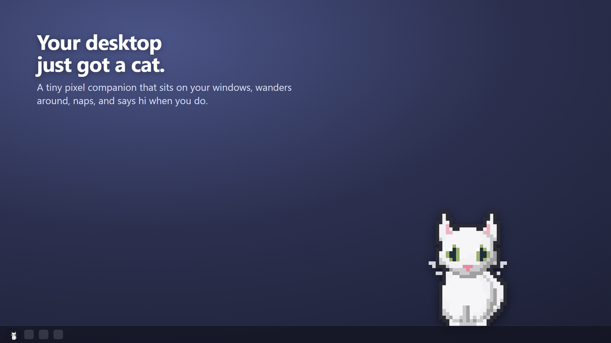
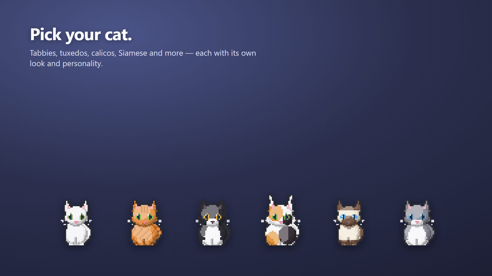
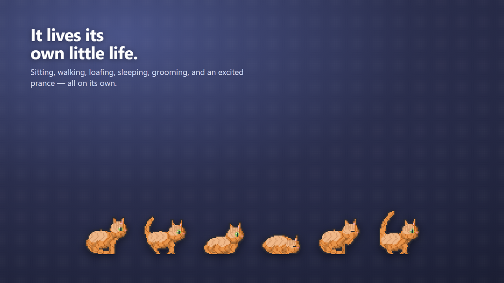
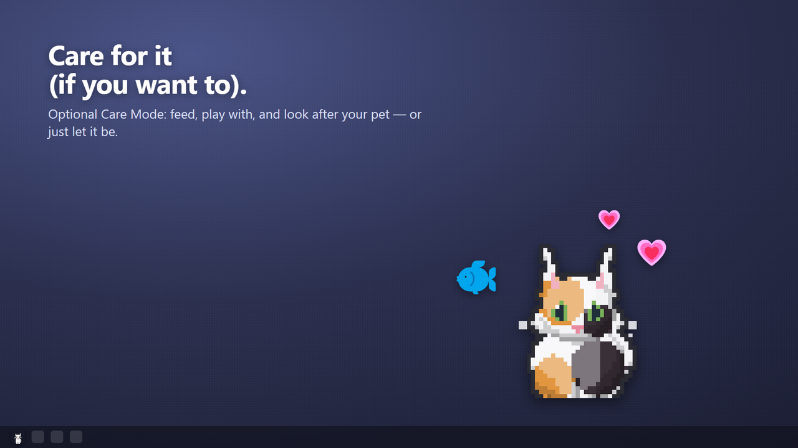
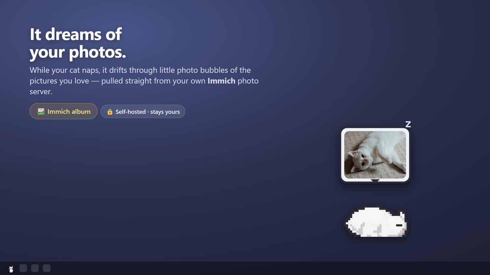
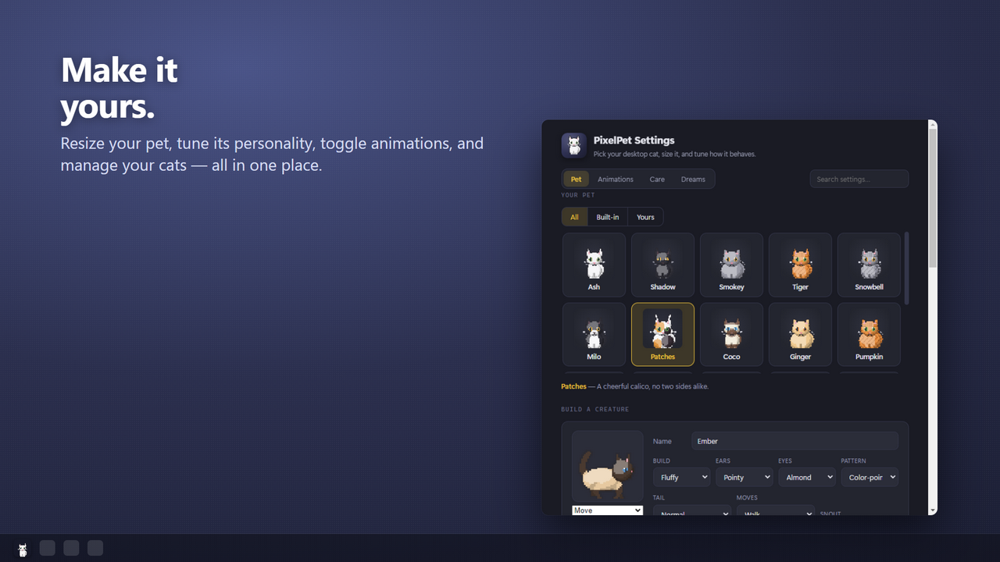
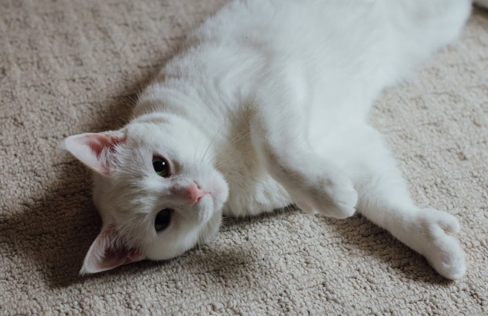

# 🐾 PixelPet

A customizable pixel-art desktop pet for **Windows and macOS**. A little cat — or a dog, or a
rabbit, or whatever you build — lives on your desktop. It sits on top of your windows, wanders
around on its own, naps, and reacts when you hover, click, or drag it. When it sleeps, it
dreams about your own photos, straight from your [Immich](https://immich.app/) server.
Everything lives in the system tray.



## Download

### Microsoft Store (Windows — recommended)

**[⬇️ Get Pixel Pets on the Microsoft Store](https://apps.microsoft.com/detail/9MZ89Q1DGR0R)**

Signed by the Store, so no SmartScreen warning, and Windows keeps it up to date for you.

### Direct download

**[⬇️ Latest GitHub release](https://github.com/guscatalano/PixelPet/releases/latest)**

- **Windows installer** — `PixelPet-Setup-x.y.z.exe`. Installs to your user profile, adds a
  Start-menu shortcut, and updates itself automatically.
- **Windows portable** — `PixelPet-x.y.z.exe`. No install; just run it.
- **macOS** — universal `.dmg` (Intel + Apple Silicon). Runs as a menu-bar agent, no Dock icon.

Once it's running, look for the 🐾 icon in the system tray (or menu bar) for settings,
show/hide, and updates.

> **Heads up — the direct downloads aren't code-signed yet.** On Windows, SmartScreen may warn
> you the first time: click **More info → Run anyway**. On macOS, Gatekeeper will block it:
> right-click the app → **Open** → **Open**. The Store build is signed and needs neither.
> (Code signing is on the roadmap.)

## Features

- **Transparent, always-on-top pet** with per-pixel interaction — only the pet's own pixels
  catch the mouse; empty space stays click-through, so it never gets in your way.
- **It stands on your windows.** On Windows, PixelPet reads the live window layout and treats
  window tops and the taskbar as ledges: the pet walks along them, falls when one closes,
  and teeters at the edge before deciding whether to jump. (On macOS it sticks to the floor.)
- **Over twenty animations** — idle breathing, sit, loaf, sphinx, walk, trot, stalk, hop,
  prance, groom, yawn, stretch, curled-up sleep, ballistic pounce, teeter, and a ¾ head-turn
  so it looks at you when it settles.
- **Personality drives behavior.** Six trait axes — energy, sleepiness, affection, mischief,
  curiosity, independence — weight the ambient loop. Sleepy pets nap more; mischievous ones
  take the risky jump.
- **Twenty built-in cats**, from Ash the white shorthair to tabbies, tuxedos, calicos and
  Siamese, each with its own look and temperament.
- **Build your own creature** — no AI required. Pick a build (normal, chonky, slim, kitten,
  fluffy, big-ears), ear style (pointy, tufted, floppy), eyes (round, almond, sleepy), tail
  (default, bushy, thin, nub), gait, coat pattern (solid, tabby, tuxedo, calico, points,
  bicolor), and a snout — a snout plus floppy ears gets you a dog; skip it for a cat.
- **Or generate one from a photo.** Point it at pictures of your real pet and a vision model
  (OpenAI or Anthropic) infers a matching pixel pet. Your API key is encrypted at rest with
  the OS keychain, never stored in plain settings.
- **Care Mode (optional).** Hunger, energy, fun, and hygiene decay over time and feed into
  overall health; feed, play, rest, groom, and medicate from the tray. Three difficulties —
  relaxed, normal, demanding. Off by default: you can just let your pet be.
- **Dream Mode, with [Immich](https://immich.app/) built in.** While your pet naps, it drifts
  through little photo bubbles of the pictures you love — pulled live from an album on your own
  self-hosted Immich server, and/or the photos you created the pet from. Double-click a bubble
  to open the photo full-size. **[Setup ↓](#dream-mode--immich)**
- **Make it yours** — ten sizes from 44 to 308 pixels wide, with quarter-steps at the small
  end where each whole step would otherwise double the pet; a Detail control (½× to 4×) that
  re-renders the same pet at a different pixel resolution; turn speed, per-pet personality
  sliders, per-animation toggles, and renaming.
- **No web engine dependency** — built on Electron, which bundles its own Chromium, so it
  works even if Edge/WebView2 is removed.

## Screenshots

|  |  |
| --- | --- |
| <br>**Pick your cat** — tabbies, tuxedos, calicos, Siamese and more. | <br>**It lives its own little life** — sit, walk, loaf, sleep, groom, prance. |
| <br>**Care for it (if you want to)** — optional Care Mode. | <br>**It dreams of your photos** — straight from your Immich album. |
| <br>**Make it yours** — the real settings window: pets, size, personality, animations. | |

## Dream Mode & Immich

PixelPet integrates with [**Immich**](https://immich.app/), the self-hosted photo server, so
your pet dreams about your actual photo library instead of stock art. Your app talks to *your*
server directly — there's no PixelPet cloud in the middle, and the API key never leaves the
machine.

Turn it on in **Settings → Dreams**:

| Field | What to enter |
| --- | --- |
| **Server URL** | Your Immich base URL, e.g. `https://immich.example.com` |
| **Album id** | The album's UUID — or just paste the whole album URL and PixelPet pulls the id out of it |
| **API key** | From Immich → *Account Settings → API Keys*. Stored encrypted through the OS keychain, never in `settings.json` |

Hit **Test** to confirm the connection. PixelPet re-reads the album every 30 minutes, and each
dream bubble shows the next photo; double-clicking one opens it full-size. You can also set how
often your pet dreams and how big the bubble is.

## Roadmap

- **Code signing** for the direct downloads, to retire the SmartScreen and Gatekeeper warnings.
- **winget** — `winget install PixelPet`, once the signed build lands.
- **More environment triggers** — music playing, a program launching, time of day — through the
  open trigger→reaction system.
- **Linux** support.

## How a pet works

A pet is **pure data, not a bitmap.** Its DNA — build proportions, coat markings, colors, ear
and tail style, snout, eye shape, personality — is rendered procedurally at draw time:

- `src/shared/catgen.ts` — the front view (and the curled sleep pose)
- `src/shared/rigcat.ts` — the articulated side rig: every standing, sitting, and moving pose
- `src/shared/turn34.ts` — the ¾ head-turn keyframes
- `src/shared/petdna.ts` — the constrained DNA vocabulary and `dnaToPet`

There are no sprite sheets. That's why recoloring, resizing, changing the pixel detail, and
generating a brand-new species from a photo are all just different data through the same
renderers.

## Development

Requires Node.js 20+.

```bash
npm install
npm run dev        # launch the pet in development (hot reload)
npm run typecheck  # type-check main + renderer
npm run build      # compile main/preload/renderer into out/
npm run dist       # build a Windows installer + portable exe into release/
```

Marketing screenshots are generated, not hand-captured — real pixel-pet sprites and a real
capture of the settings window, composed onto branded scenes by `scripts/genStoreScreens.mjs`.
Run `npm run build` first, since the settings window is captured from `out/`:

```bash
npm run shots:readme   # 1280x720 -> docs/screenshots/ (committed, shown above)
npm run shots:store    # 1920x1080 -> store-assets/ (git-ignored, for Partner Center)
```

The dream-bubble scene shows Ash's photo by default (the one embedded for the About
dedication). Pass `--photo <path>` to swap in a different one.

### Project layout

```
src/
  main/              Electron main process
    ai/              vision provider -> PetDNA (OpenAI / Anthropic), encrypted key storage
    behavior/        the pet's "brain": physics, trigger->reaction engine, personality, ambient loop
    care/            Care Mode needs model + persistence
    desktop/         Win32 window enumeration (koffi FFI) -> the ledges the pet stands on
    dream/           Dream Mode photo sources (local store + Immich)
    index.ts         windows, IPC, app lifecycle
    settings.ts      persisted settings (userData/settings.json)
    tray.ts          system tray
    updater.ts       electron-updater wiring (disabled in Store builds)
  preload/           typed IPC bridges
  renderer/
    pet/             canvas animation engine (source-agnostic clip player)
    settings/        settings window
    dream/  item/    dream photo bubble, dragged care items
  shared/            pet data + the procedural renderers (see "How a pet works")
scripts/             dependency-free PNG/ICO generators, demo + QA harnesses, screenshot generators
assets/              generated icons (regenerated by `npm run gen:icons`)
docs/screenshots/    generated screenshots (regenerated by `npm run shots:readme`)
```

## Releases

Pushing a `vX.Y.Z` tag triggers the GitHub Actions pipeline, which builds the Windows
installer + portable exe and the macOS universal build, and publishes them to a GitHub
Release. Every push/PR also builds and uploads artifacts so `main` always has a working build.
Directly-installed copies **update themselves** from these releases (via `electron-updater`);
Store copies are updated by Windows instead.

The Microsoft Store MSIX is a separate track — see **[RELEASING.md](RELEASING.md)** for both
runbooks.

## License

MIT

---

<div align="center">
  
  <p><em>In loving memory of <b>Ash</b> 🐾<br>
  the cat PixelPet is named for, and all the joy she brought.</em></p>
</div>
